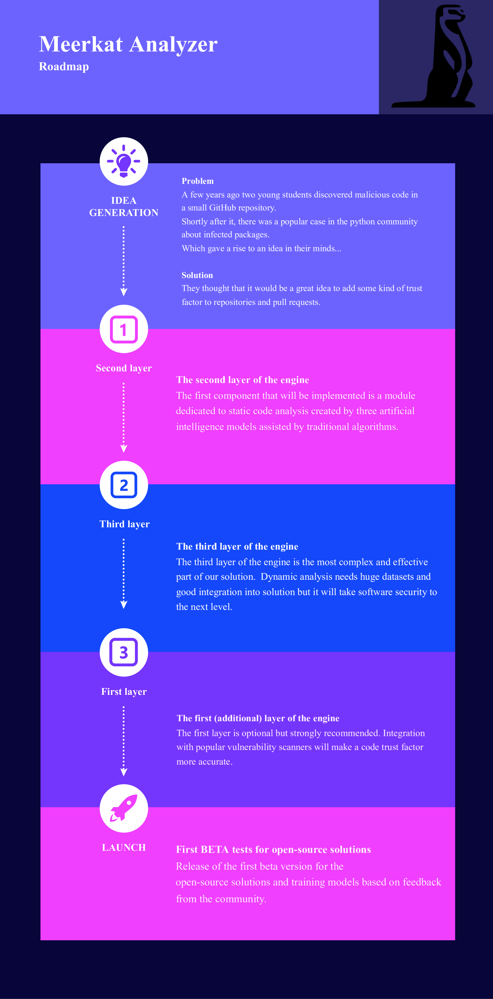

# MeerkatAnalizer
  
### _Let us watch over the security of your project_ 
Meerkat is a powerful AI-based system for security and trust assessment of the commits and pulls requests to your repository.
Our main goal is to detect malicious changes in your project that could be (or cause) backdoors.  
 
## Why should you use Meerkat?  
The main reasons for the usage of the MeerkatAnalizer are:  
1. **Safer project**  
You don't need to worry about a corrupted or angry employee that could destroy the reputation of your solution.
2. **Faster software development**  
Your project managers and security team will spend less time on change analysis.  
3. **Modern technologies**  
Usage of modern and well-known technologies like Hugging Face and TensorFlow.
4. **Work out of the box**  
You do not write code or complex configuration just connect our solution to your CI/CD  
   
  
## How does it work?
MeerkatAnalizer should be run as part of the CI/CD.
When a new pull request or commit shows up our solution will check changes in three layers:
1. Vulnerability research - you can use our engine or configure the usage of the snyk  
2. AI-based backdoor detection - our AI is looking for unusual and suspicious code that could cause:  
    * Remote Code Execution  
    * Data breach  
    * Ransomware attack  
    * Steal credentials  
3. Application fuzzing - fuzz binary/endpoints with AFL and our AI that looks for suspicious behaviour (executing unpredicted commands or sending packets).

## Trust factor
Add trust factor generated by our AI to your repository:   
  
  
  

Verify pull request with CI/CD:  

## Roadmap

